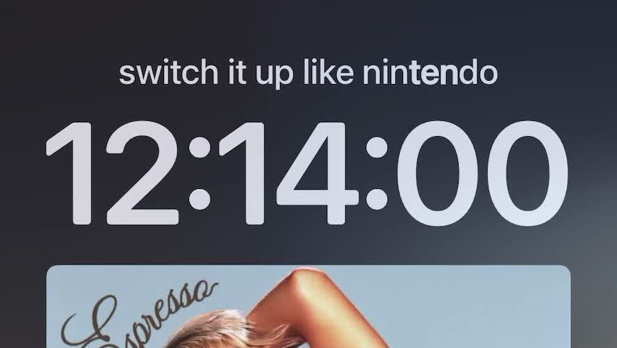

# DateLyrics 🎵
### Apple Music lyrics in the Lock Screen date view!

DateLyrics brings Apple Music lyrics to the lock screen date widget view. DateLyrics also supports word-by-word lyric highlighting on supported songs.

---

<table align="center">
  <tr>
    <td align="center">
      <picture>
        <source media="(prefers-color-scheme: dark)" srcset="DateLyricsIconDark.png">
        
      </picture>
    </td>
    <td align="center">
      
    </td>
  </tr>
</table>

---

## Compatibility

DateLyrics supports any **rootless jailbreak** on iOS 16.0 and later. Users running semi-jailbreaks such as **NathanLR** will need to inject tweaks into the Music application in order for DateLyrics to work.

Download the latest version from **[Releases](https://github.com/shalamand3r/DateLyrics/releases)**.

---

  

