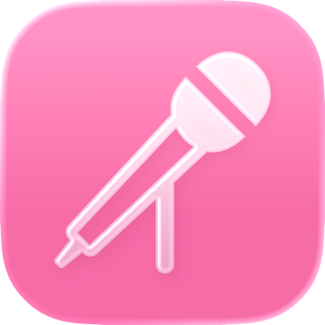
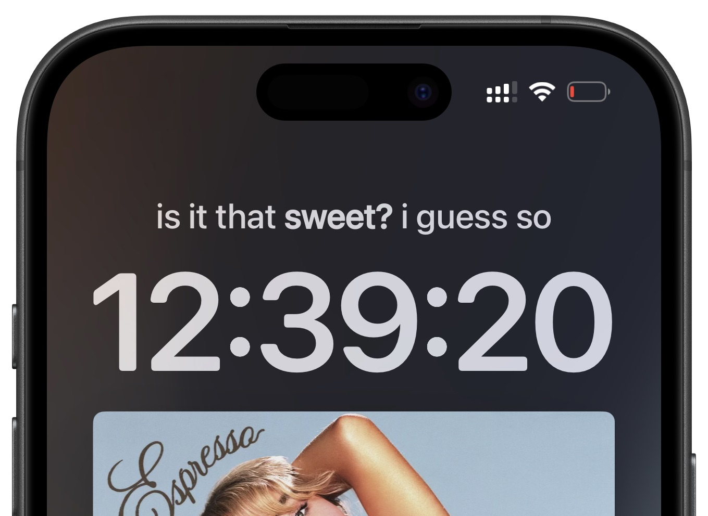

# DateLyrics 🎵
### Apple Music lyrics in the Lock Screen date view!

DateLyrics brings Apple Music lyrics to the lock screen date widget view. Lyrics are pulled directly from Apple Music, which means that word-by-word lyrics (karaoke style syllable highlighting) is also supported when available.

---

<table align="center">
  <tr>
    <td align="center">
      <picture>
        <source media="(prefers-color-scheme: dark)" srcset="DateLyricsIconDark.png">
        
      </picture>
    </td>
    <td align="center">
      
    </td>
  </tr>
</table>

---

## Compatibility

DateLyrics supports any **rootless jailbreak** on iOS 16.0 and later. Users running semi-jailbreaks such as **NathanLR** will need to inject tweaks into the Music application in order for DateLyrics to work.

Download the latest version from **[Releases](https://github.com/shalamand3r/DateLyrics/releases)** or **[Add my Sileo Repo](https://shalamand3r.github.io)**

---

  

